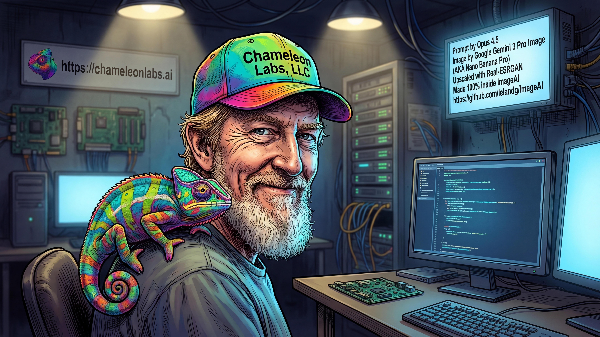

## Hello, I'm Leland Green

- Coder since 1978—I learned BASIC on my father's TRS-80, then dove into a Commodore 64 (one of the first 4000 off the line). 
- I Majored in art, minored in music, became an Advanced Software Engineer by teaching myself. Go figure.

### Tools for your agents
Claude Code is my primary development tool. But you can point any agent at the repos below to use the skills.  
- 🤖 **[.claude_code](https://github.com/lelandg/.claude_code)** — My setup for Claude Code. Includes my agents, global CLAUDE.md, custom skills to merge into your config, and more. Now in my plugin markeplace
```
/plugin marketplace add lelandg/.claude_code
/plugin install claude-config-skills@lelandg-claude-config
```
To update
```
/plugin marketplace update lelandg/.claude_code
```
### 🦎 Chameleon Labs Plugin Markeplace
Lots of goodies for developers
```
/plugin marketplace add Chameleon-Labs-LLC/plugins
```
Also available in plugins, included with our open-source repos: [Chameleon Labs organization profile](https://github.com/Chameleon-Labs-LLC)

🌐 **[Chameleon Labs](https://chameleonlabs.ai)** — Co-founded in Oct 2025. Building AI-powered web applications, back-ends.

## ImageAI

🖼️ **[ImageAI](https://github.com/lelandg/ImageAI)** — Python image and video generator that supports multiple LLM providers (OpenAI, Anthropic, Gemini, Stability AI, local models via Ollama). Built entirely with Claude Code CLI. Great example of practical LLM and media integration.

**What features would you like?**

### Other Projects
- 🎦 **[Raspberry-Pi-Security-Camera](https://github.com/lelandg/Raspberry-Pi-Security-Camera)** — Motion detection + email alerts + Linphone server
- 🤖 **[PromptAlchemy](https://github.com/lelandg/PromptAlchemy)** — Cross-platform prompt enhancement tool (GUI + CLI)

### Connect
- 🌐 [LelandGreen.com](https://lelandgreen.com)
- 🏢 [Chameleon Labs GitHub](https://github.com/Chameleon-Labs-LLC)
- 💬 [Chameleon Labs Discord](https://discord.gg/chameleonlabs)

# Brief History 
- C Language
  - I learned C in 1989 from The Shareware Library. A friend gave me a copy.
  - I used it to get all the jobs below. 
  - I used the public library to access the internet. Not sure exact year, but I used Gopher, Usenet, etc. to learn.
  - To first access local BBSs to learn ane meet people.
- The Tech Consultant, 1992 - 19998
  - Contract development.
- **Master Designs, Inc.** Head Programmer at ChatMaster BBS, 1993-1998
  - My boss hired me as soon as they had enough computers.
  - We were the first commercial internet provider in Springfield, Missouri.
  - Everything was written in C for Major BBS systems or MBBS. (If you're curious, Google knows about the developer and operator manuals.)
  - MBBS and our modules were distributed as source code.
  - We could modify the base system and develop add-ons that were compiled as DLLs.
- **Jack Henry and Associates** Developr → Advanced Software Engineer
  - When I started, it was called **DataTrade LLC**.
  - Started as a data conversion developer because my boss liked the fact I did midnight cleanup routines at ChatMaster.
  - Eventually became team leader.
  - The company was bought by Jack Henry and Associates. (I heard that a big reason they bought us was because of the data conversion.)

